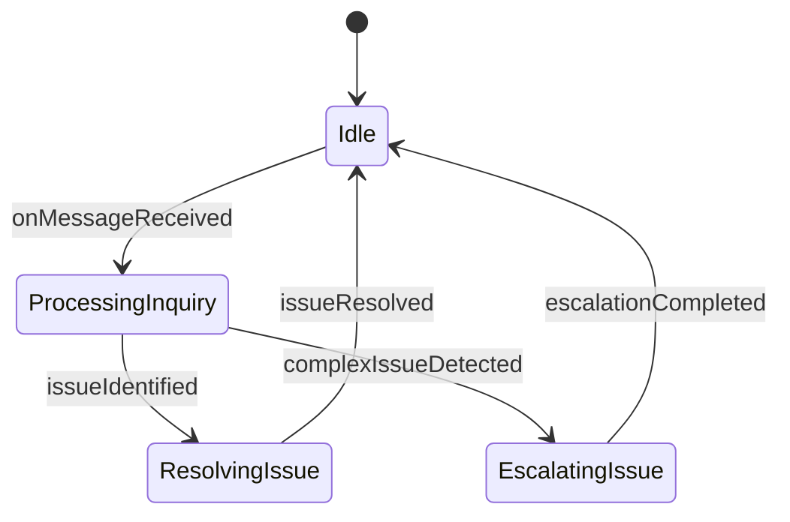
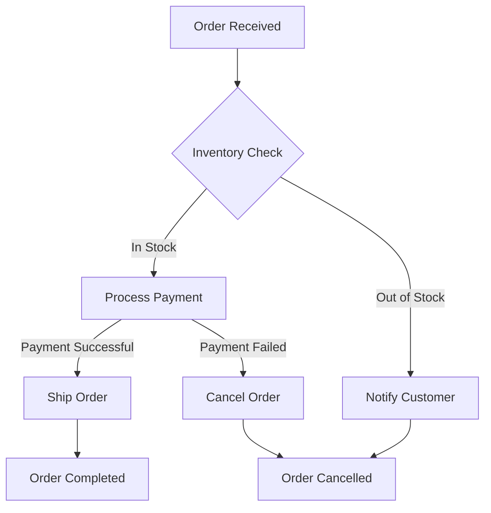

# agentic.md

Build AI Agents and Agentic Workflows in Markdown

[](https://github.com/drivly/agentic.md/blob/main/LICENSE)
[](https://github.com/drivly/agentic.md/blob/main/CONTRIBUTING.md)
[](https://discord.gg/tafnNeUQdm)
[](https://github.com/drivly/agentic.md)

## Overview

`agentic.md` is a TypeScript library that enables you to define, visualize, and execute AI Agents and Agentic Workflows using Markdown and Mermaid diagrams. It seamlessly integrates with the [Drivly AI ecosystem](https://github.com/drivly/ai) to provide a simple, declarative way to build powerful AI applications.

## Features

- **Markdown-First Development**: Define your agents and workflows in plain Markdown
- **Mermaid Diagram Integration**: Visualize and generate agents and workflows from Mermaid diagrams
- **XState State Machines**: Automatically generate robust state machines from your diagrams
- **AI Agent Generation**: Create autonomous agents from your Markdown definitions
- **Composable Architecture**: Build complex systems from simple, reusable components
- **TypeScript Support**: Full type safety and autocompletion

## Installation

```bash
npm install agentic.md
# or
yarn add agentic.md
# or
pnpm add agentic.md
```

## Quick Start

### Define an Agent in Markdown

```md
# Customer Support Agent

## Description
Handles customer inquiries and resolves common issues

## Properties
- name: Amy
- role: Customer Support Agent
- integrations: chat, slack, email, zendesk, shopify

## Workflow



## Generate and Use an Agent

```typescript
import { createAgentFromMarkdown } from 'agentic.md';
import { Agent } from 'agents';
import fs from 'fs';

// Load markdown file
const markdown = fs.readFileSync('./customer-support-agent.md', 'utf-8');

// Create agent from markdown
const customerSupportAgent = createAgentFromMarkdown(markdown);

// Use the agent
customerSupportAgent.onMessageReceived({
  from: 'customer@example.com',
  content: 'I need help with my recent order'
});
```

## Workflow Definition

Define complex workflows using Mermaid diagrams in your Markdown:

```md
# Order Processing Workflow

## Description
Handles the end-to-end order processing flow

## Workflow



## Generate and Use a Workflow

```typescript
import { createWorkflowFromMarkdown } from 'agentic.md';
import { interpret } from 'xstate';

// Load markdown file
const markdown = fs.readFileSync('./order-processing.md', 'utf-8');

// Create workflow from markdown
const orderProcessingWorkflow = createWorkflowFromMarkdown(markdown);

// Interpret and start the workflow
const orderService = interpret(orderProcessingWorkflow)
  .onTransition(state => console.log(state.value))
  .start();

// Send events to the workflow
orderService.send({ type: 'ORDER_RECEIVED', order: { id: '12345', items: [...] } });
```

## Supported Mermaid Diagram Types

`agentic.md` supports multiple Mermaid diagram types, each serving different aspects of agent and workflow definition:

- **State Diagrams**: Define agent states and transitions
- **Flowcharts**: Model decision trees and process flows
- **Sequence Diagrams**: Specify interactions between agents and systems
- **Class Diagrams**: Define agent properties and relationships
- **Entity Relationship Diagrams**: Model complex data relationships

## Integration with Drivly AI Ecosystem

`agentic.md` seamlessly integrates with the [Drivly AI ecosystem](https://github.com/drivly/ai):

```typescript
import { createAgentFromMarkdown } from 'agentic.md';
import { AI } from 'workflows.do';

// Create agent from markdown
const agent = createAgentFromMarkdown('./agent.md');

// Use with workflows.do
const workflow = AI({
  processCustomerInquiry: async ({ ai, api, event }) => {
    const response = await agent.processInquiry(event.message);
    return response;
  }
});
```

## Advanced Features

### Custom Agent Templates

Create reusable agent templates:

```typescript
import { defineAgentTemplate } from 'agentic.md';

const customerSupportTemplate = defineAgentTemplate({
  name: 'CustomerSupport',
  defaultProperties: {
    role: 'Customer Support Agent',
    integrations: ['chat', 'email'],
  },
  methods: {
    async resolveSimpleInquiry(inquiry) {
      // Implementation
    }
  }
});

// Use template
const agent = customerSupportTemplate.createAgent('./custom-support-agent.md');
```

### Workflow Composition

Compose multiple workflows together:

```typescript
import { composeWorkflows } from 'agentic.md';

const orderWorkflow = createWorkflowFromMarkdown('./order-workflow.md');
const paymentWorkflow = createWorkflowFromMarkdown('./payment-workflow.md');
const shippingWorkflow = createWorkflowFromMarkdown('./shipping-workflow.md');

const e2eWorkflow = composeWorkflows({
  order: orderWorkflow,
  payment: paymentWorkflow,
  shipping: shippingWorkflow
});
```

## Contributing

We welcome contributions! Please see our [Contributing Guide](CONTRIBUTING.md) for more details.

## License

This project is licensed under the MIT License - see the [LICENSE](LICENSE) file for details.
