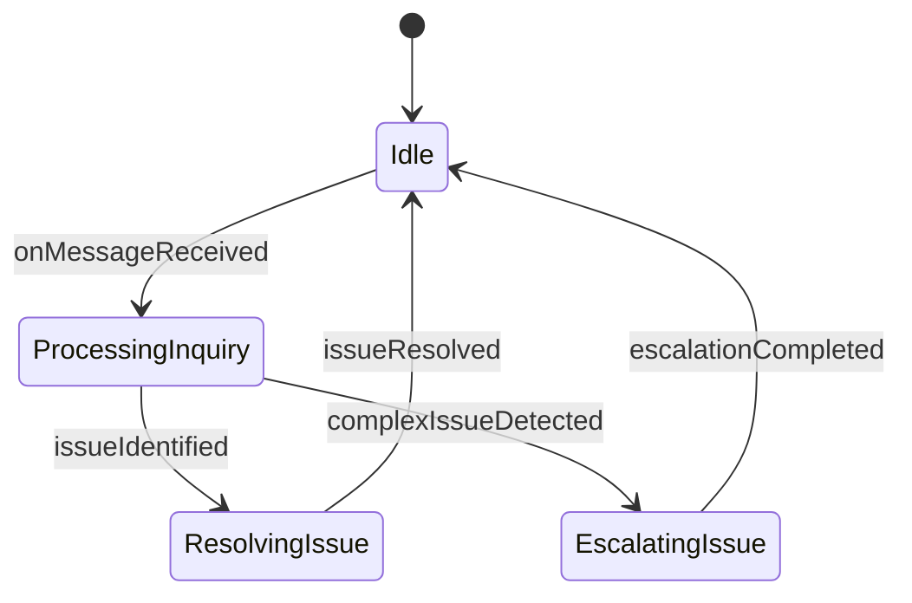
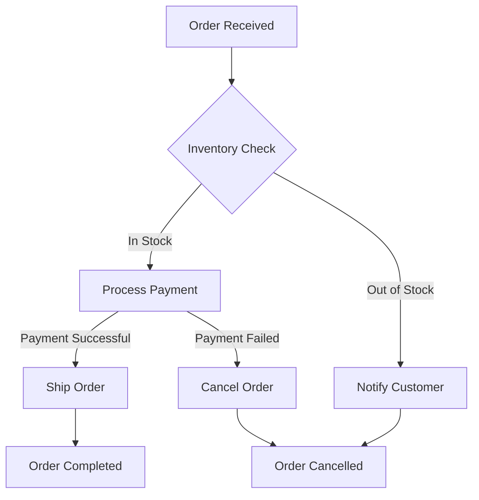

# [agentic.md](https://github.com/drivly/agentic.md) Build AI Agents & Agentic Workflows in Markdown

[](https://github.com/drivly/agentic.md/blob/main/LICENSE)
[](https://github.com/drivly/agentic.md/blob/main/CONTRIBUTING.md)
[](https://discord.gg/tafnNeUQdm)
[](https://github.com/drivly/agentic.md)

Define, visualize, and execute AI Agents and Agentic Workflows using Markdown and Mermaid diagrams. Seamlessly integrates with the [Drivly AI ecosystem](https://github.com/drivly/ai).

## Define an Agent in Markdown

```md
# Customer Support Agent

## Description
Handles customer inquiries and resolves common issues

## Properties
- name: Amy
- role: Customer Support Agent
- integrations: chat, slack, email, zendesk, shopify

## Workflow



## Generate and Use an Agent

```typescript
import { createAgentFromMarkdown } from 'agentic.md'
import { Agent } from 'agents'
import fs from 'fs'

// Load markdown file
const markdown = fs.readFileSync('./customer-support-agent.md', 'utf-8')

// Create agent from markdown
const customerSupportAgent = createAgentFromMarkdown(markdown)

// Use the agent
customerSupportAgent.onMessageReceived({
  from: 'customer@example.com',
  content: 'I need help with my recent order'
})
```

## Define a Workflow in Markdown

```md
# Order Processing Workflow

## Description
Handles the end-to-end order processing flow

## Workflow



## Generate and Use a Workflow

```typescript
import { createWorkflowFromMarkdown } from 'agentic.md'
import { interpret } from 'xstate'

// Create workflow from markdown
const orderProcessingWorkflow = createWorkflowFromMarkdown('./order-processing.md')

// Interpret and start the workflow
const orderService = interpret(orderProcessingWorkflow)
  .onTransition(state => console.log(state.value))
  .start()

// Send events to the workflow
orderService.send({ type: 'ORDER_RECEIVED', order: { id: '12345', items: [...] } })
```

## Integration with Drivly AI Ecosystem

```typescript
import { createAgentFromMarkdown } from 'agentic.md'
import { AI } from 'workflows.do'

// Create agent from markdown
const agent = createAgentFromMarkdown('./agent.md')

// Use with workflows.do
const workflow = AI({
  processCustomerInquiry: async ({ ai, api, event }) => {
    const response = await agent.processInquiry(event.message)
    return response
  }
})
```

## Supported Mermaid Diagram Types

- **State Diagrams**: Define agent states and transitions
- **Flowcharts**: Model decision trees and process flows
- **Sequence Diagrams**: Specify interactions between agents and systems
- **Class Diagrams**: Define agent properties and relationships
- **Entity Relationship Diagrams**: Model complex data relationships

## Features

- **Markdown-First Development**: Define agents and workflows in plain Markdown
- **Mermaid Diagram Integration**: Visualize and generate from Mermaid diagrams
- **XState State Machines**: Generate robust state machines from diagrams
- **AI Agent Generation**: Create autonomous agents from Markdown definitions
- **Composable Architecture**: Build complex systems from simple components
- **TypeScript Support**: Full type safety and autocompletion
