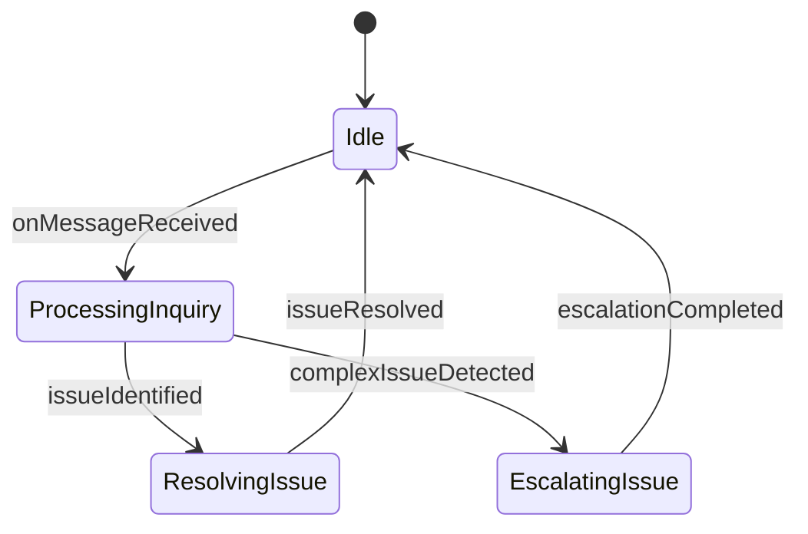
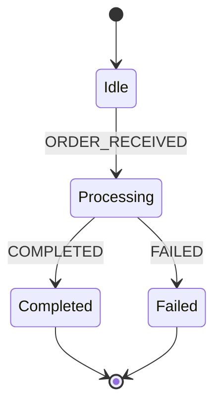

# [agentic.md](https://github.com/drivly/agentic.md) Build AI Agents & Agentic Workflows in Markdown

[](https://github.com/drivly/agentic.md/blob/main/LICENSE)
[](https://github.com/drivly/agentic.md/blob/main/CONTRIBUTING.md)
[](https://discord.gg/tafnNeUQdm)
[](https://github.com/drivly/agentic.md)

Define, visualize, and execute AI Agents and Agentic Workflows using Markdown and Mermaid diagrams. Seamlessly integrates with the [Drivly AI ecosystem](https://github.com/drivly/ai).

## Define an Agent in Markdown

```md
# Customer Support Agent

## Description
Handles customer inquiries and resolves common issues

## Properties
- name: Amy
- role: Customer Support Agent
- integrations: chat, slack, email, zendesk, shopify

## Workflow




## Generate and Use an Agent

```typescript
import { createAgentFromMarkdown } from 'agentic.md'
import fs from 'fs'

// Load markdown file
const markdown = fs.readFileSync('./customer-support-agent.md', 'utf-8')

// Create agent from markdown
const customerSupportAgent = createAgentFromMarkdown(markdown)

// Use the agent
customerSupportAgent.onMessageReceived({
  from: 'customer@example.com',
  content: 'I need help with my recent order'
})
```

## Generate XState Machines from Mermaid Diagrams

```typescript
import { createWorkflowFromMarkdown } from 'agentic.md'
import { interpret } from 'xstate'
import fs from 'fs'

// Load markdown with Mermaid state diagram
const markdown = fs.readFileSync('./support-workflow.md', 'utf-8')

// Generate XState machine from Mermaid diagram
const machine = createWorkflowFromMarkdown(markdown)

// The generated machine structure:
// {
//   id: 'workflow',
//   initial: 'Idle',
//   states: {
//     Idle: {
//       on: { onMessageReceived: 'ProcessingInquiry' }
//     },
//     ProcessingInquiry: {
//       on: {
//         issueIdentified: 'ResolvingIssue',
//         complexIssueDetected: 'EscalatingIssue'
//       }
//     },
//     ResolvingIssue: {
//       on: { issueResolved: 'Idle' }
//     },
//     EscalatingIssue: {
//       on: { escalationCompleted: 'Idle' }
//     }
//   }
// }

// Use the machine with XState
const service = interpret(machine)
  .onTransition(state => console.log(state.value))
  .start()

// Send events to the state machine
service.send('onMessageReceived')
```

## Define a Workflow in Markdown

```md
# Order Processing Workflow

## Description
Handles the end-to-end order processing flow

## Workflow



## Compose Multiple Workflows

```typescript
import { createWorkflowFromMarkdown, composeWorkflows } from 'agentic.md'
import fs from 'fs'

// Load multiple workflow definitions
const orderWorkflow = createWorkflowFromMarkdown(
  fs.readFileSync('./order-workflow.md', 'utf-8')
)

const paymentWorkflow = createWorkflowFromMarkdown(
  fs.readFileSync('./payment-workflow.md', 'utf-8')
)

// Compose workflows into a single state machine
const composedWorkflow = composeWorkflows({
  orders: orderWorkflow,
  payments: paymentWorkflow
})

// Use the composed workflow
const service = interpret(composedWorkflow).start()
```

## Integration with Drivly AI Ecosystem

```typescript
import { createAgentFromMarkdown } from 'agentic.md'
import { AI } from 'ai'

// Create agent from markdown
const agent = createAgentFromMarkdown('./agent.md')

// Use with AI
const workflow = AI({
  processCustomerInquiry: async ({ ai, event }) => {
    const response = await agent.processInquiry(event.message)
    return response
  }
})
```

## Features

- **Markdown-First Development**: Define agents and workflows in plain Markdown
- **Mermaid → XState**: Generate state machines directly from Mermaid diagrams
- **AI Agent Generation**: Create autonomous agents from Markdown definitions
- **Composable Architecture**: Build complex systems from simple components
- **TypeScript Support**: Full type safety and autocompletion
